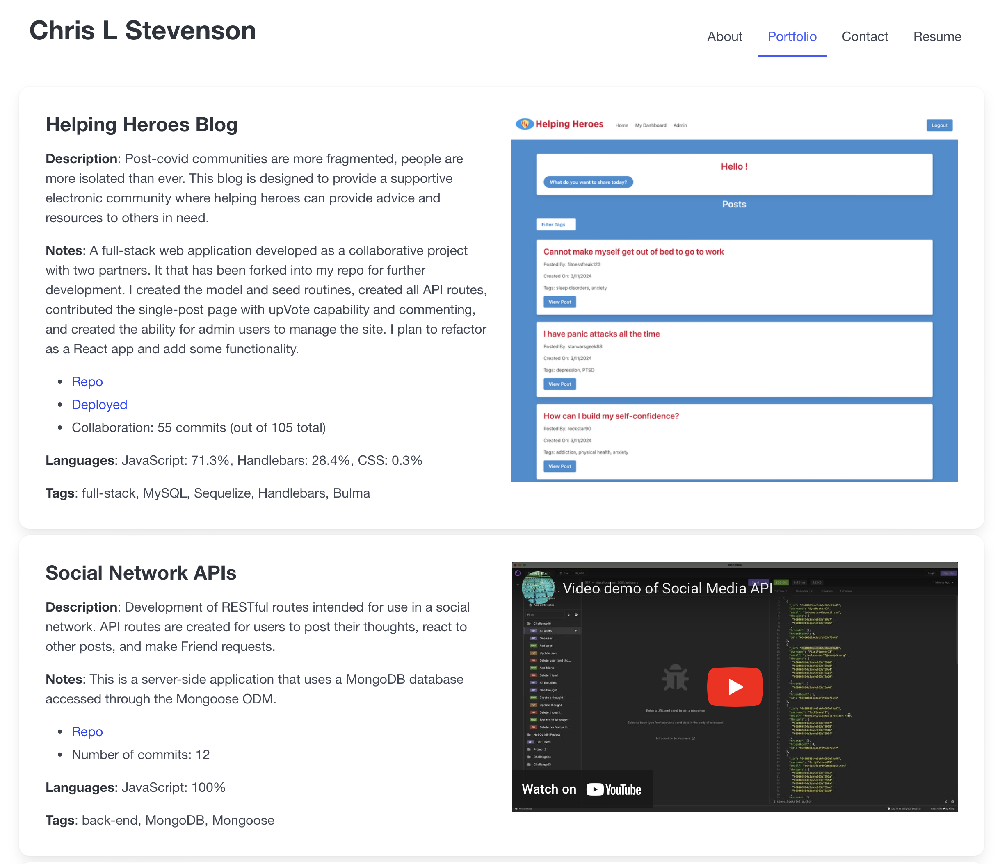

# My Development Portfolio

## Description

This website app was created to present my development portfolio and showcase my skills and strengths as a developer. The front-end was created with React using `styled-components` and a few [Radix](https://www.radix-ui.com) primitives. It contains a simple `node.js` back-end to send emails using `nodemailer`.

A screenshot of the top of the portfolio page (as initially deployed) is below.

## Use

This app has is now deployed on Render at:

<https://cls-dev-portfolio.onrender.com>

The code itself is licensed under MIT and can be found in the following GitHub repo.

<https://github.com/clstevenson/my-dev-portfolio>

## Questions

Reach out if you have questions that are not covered here!

- GitHub username: clstevenson
- email: cstevens@richmond.edu

## License

This project is licensed under the terms of the [MIT license](https://opensource.org/licenses/MIT).
